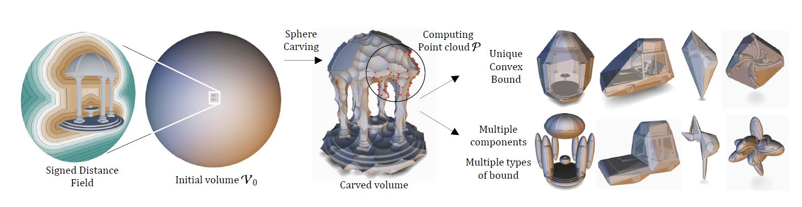
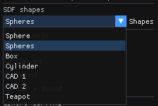
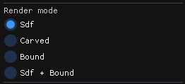
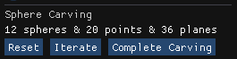

# Sphere Carving

This is the code release repository for the 2025 SIGGRAPH paper *Sphere Carving: Bounding Volumes for Signed Distance Fields*. 
Note that this implementation differs from the one presented in the paper.



[Project page](https://aparis69.github.io/SphereCarving/index.html)

[Video](https://aparis69.github.io/SphereCarving/documents/video.mp4)

## Compile

Clone the repository using:
```
git clone https://github.com/H-Schott/SphereCarvingRelease.git
```

Can be compiled on Windows, MacOS and Linux using the CMake file. 
This demo requires OpenGl 3.3 or higher.

On Linux, additional packages may be required:
```
libxi-dev libxcursor-dev libxinerama-dev libxrandr-dev
```

On MacOS and Linux, the executable file will be generated in your build folder at *src/code/main*.
On Windows, a Visual Studio project will be generated. You might need to select *main* as the startup project inside VS.

## Workflow



Several built-in shapes can be selected using the combo box.
Adding new shapes can be done by editing *sdf.h* and *sdf.cpp*.



Different render modes are available:
- SDF: only the implicit shape
- Carved: carved volume (initial sphere minus all carving spheres)
- Bound: full convex bounding volume (intersection of every half spaces of the convex hull)
- SDF + Bound: both the implicit shape and its bound

By default, the carved volume and bound are initialized with 1 iteration of Sphere Carving.



The carving process can be reset, iterated, or completed by clicking the relevant buttons. For some models, the process might take a few seconds.

## License and Citation
```
@article{schott2025,
	title = {Sphere Carving: Bounding Volumes For Signed Distance Fields},
	author = {Schott, Hugo and Thonat, Theo and Lambert, Thibaud and Guérin, Eric and Galin, Eric and Paris, Axel},
	journal = {ACM Transaction on Graphics (SIGGRAPH '25 Conference Proceedings)},
	publisher = {ACM},
	year = {2025},
	number = {44},
	volume = {4}
}
```
This code is released under MIT License.
